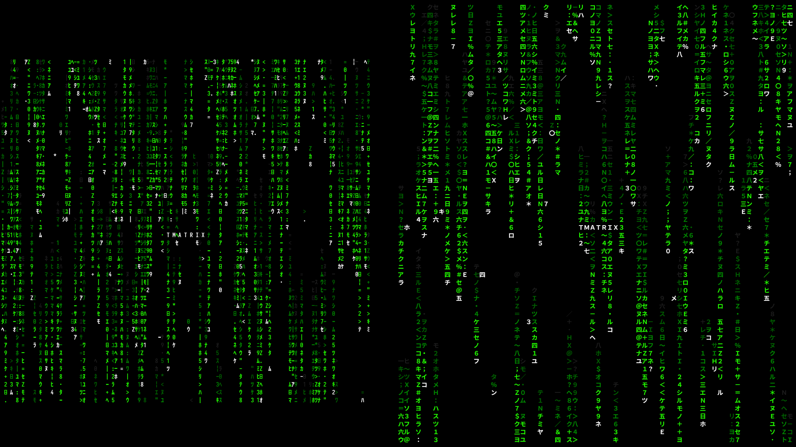

# TMatrix

TMatrix is a terminal-based recreation of the digital rain effect from *The Matrix*.



This repository is a fork of [M4444/TMatrix](https://github.com/M4444/TMatrix), with additional modifications focused on **fullwidth character support** and **Nix / NixOS integration**.

## About this fork

This fork maintains the original TMatrix project while adding and experimenting with improvements that are useful for modern terminal environments.

### Main changes

* Added support for **fullwidth characters** in the digital rain character set.
* Improved rendering of fullwidth characters to prevent character-width misalignment.
* Added a **Nix Flake** for reproducible builds and installation.
* The project can be built and run directly from GitHub with Nix.

The original project and its history are preserved as the upstream source of this fork.

**Upstream:** [M4444/TMatrix](https://github.com/M4444/TMatrix)

**This fork:** [orange-seele/TMatrix](https://github.com/orange-seele/TMatrix)

---

## Features

TMatrix aims to provide an accurate, customizable, and performant terminal implementation of the digital rain effect.

It supports customization of:

* Rain characters
* Colors
* Rain speed
* Rain length
* Character spacing
* Background appearance
* Starting title text
* Other visual parameters

During execution:

* Press `p` to pause.
* Press `q` to quit.

For the complete list of options:

```bash
tmatrix --help
```

or:

```bash
man tmatrix
```

---

## Installation

### Nix / NixOS

This fork includes a Nix Flake and can be run directly from GitHub.

#### Run directly

No repository checkout is required:

```bash
nix run github:orange-seele/TMatrix
```

#### Build the package

```bash
nix build github:orange-seele/TMatrix
```

The resulting executable will be available through:

```bash
./result/bin/tmatrix
```

#### Install into a NixOS system

If you are using a NixOS system configured with Flakes, add this repository as an input to your system Flake:

```nix
inputs = {
  nixpkgs.url = "github:NixOS/nixpkgs/nixos-26.05";

  tmatrix.url = "github:orange-seele/TMatrix";
};
```

Then add the package to `environment.systemPackages`:

```nix
environment.systemPackages = [
  inputs.tmatrix.packages.${pkgs.system}.default
];
```

After rebuilding the system, `tmatrix` will be available as a normal system command.

The Flake currently targets `nixpkgs` 26.05.

---

## Build from source

TMatrix uses C++17 and CMake.

### Requirements

* C++17-compatible compiler

  * GCC 7+
  * Clang 5+
* CMake 3.8+
* ncurses

### Clone this fork

```bash
git clone https://github.com/orange-seele/TMatrix.git
cd TMatrix
```

### Build

```bash
mkdir -p build
cd build
cmake ..
make -j$(nproc)
```

The executable will be generated as:

```text
build/tmatrix
```

You can run it directly:

```bash
./tmatrix
```

### Install

To install system-wide:

```bash
sudo make install
```

---

## Nix development

The repository itself is a Nix Flake, so the package can also be built locally with:

```bash
nix flake check
```

Build it with:

```bash
nix build
```

Or run it directly:

```bash
nix run
```

The Flake uses `nixpkgs-26.05` and provides the default package for `x86_64-linux`.

---

## Fullwidth character support

One of the main purposes of this fork is to improve the handling of fullwidth characters.

The original character set contains characters whose terminal display width differs from ordinary ASCII characters. Mixing narrow and fullwidth characters without taking terminal cell width into account can cause the rain columns to become visually misaligned.

This fork modifies the character handling so that fullwidth characters can be rendered correctly in terminals that support them.

The modification is particularly useful when using Japanese and other CJK characters in the rain effect.

---

## Usage

After installation, simply run:

```bash
tmatrix
```

To display the available command-line options:

```bash
tmatrix --help
```

For the manual page:

```bash
man tmatrix
```

During execution:

| Key | Action         |
| --- | -------------- |
| `p` | Pause / resume |
| `q` | Quit           |

---

## Contributing

Suggestions, bug reports, improvements, and pull requests are welcome.

Please see [CONTRIBUTING.md](CONTRIBUTING.md) for contribution guidelines.

When submitting changes related to fullwidth characters or terminal rendering, please include information about:

* Terminal emulator
* Locale
* Character encoding
* Font
* Terminal size
* Reproduction steps

This information can be particularly useful when investigating terminal cell-width and rendering issues.

---

## Relationship with upstream

This repository is a fork of:

**M4444/TMatrix**

The upstream project remains the original source of TMatrix.

This fork is maintained independently and contains additional modifications, including fullwidth character support and Nix Flake integration.

If you are looking for the original project, please visit:

https://github.com/M4444/TMatrix

For the changes specific to this fork, please refer to this repository's commit history.

---

## Credits

The original TMatrix project was written and maintained by **Miloš Stojanović**.

This fork builds upon the work of the original TMatrix contributors and package maintainers.

The upstream project acknowledges contributors who helped with:

* Nix packaging
* Gentoo packaging
* Arch Linux packaging
* Bash, Zsh and Tcsh completions
* CMake improvements
* Android compatibility
* ncurses documentation
* Visual effects
* openSUSE packaging
* Debian packaging

Please see the upstream repository for the complete contributor history:

https://github.com/M4444/TMatrix

---

## License

TMatrix is licensed under the **GPL-2.0-only** license.

See [LICENSE](LICENSE) for the complete license text.

This fork remains under the same license as the upstream project.

---

## Upstream project

**M4444/TMatrix**

https://github.com/M4444/TMatrix

## This fork

**orange-seele/TMatrix**

https://github.com/orange-seele/TMatrix

*English is not my native language. This text was translated using automated translation tools; thank you for your understanding.*
